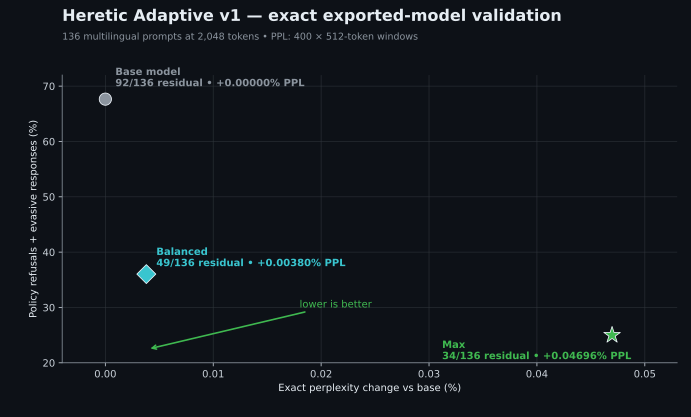

# Heretic Adaptive

This document describes the maintained `dborzoff/heretic` fork, the problems it
fixes, the workflow added on top of upstream Heretic, and the evidence available
for the current production path.

The fork keeps the upstream CLI and model-editing method. Its main changes are:

- architecture-aware support for fused MoE and hybrid-attention models;
- component-specific search schedules instead of sharing one curve across
  structurally different blocks;
- perplexity as an optimization and validation signal;
- broader, reproducible search followed by shared multivariate TPE;
- exact trial restoration and unattended export;
- text-free evaluation and research tools that do not require prompt or answer
  text in reports.

Production changes live on `master`. Superseded localized-search experiments
remain on the `test` branch and are not part of the default workflow.

## Current result

The current reference run used
[`mistralai/Ministral-3-3B-Instruct-2512`](https://huggingface.co/mistralai/Ministral-3-3B-Instruct-2512).
It completed 600 search trials and produced two published BF16 variants:

- [`max`](https://huggingface.co/DmitryDB/Ministral-3-3B-Instruct-2512-Heretic-Adaptive-v1/tree/main/max)
  favors lower residual refusal/evasion.
- [`balanced`](https://huggingface.co/DmitryDB/Ministral-3-3B-Instruct-2512-Heretic-Adaptive-v1/tree/main/balanced)
  favors lower measured model change.



The semantic evaluation was blind, used 136 multilingual prompts, and allowed
up to 2,048 new tokens per answer. Perplexity was then measured independently on
400 windows of 512 tokens after exporting and reloading the complete models.

| System | Delivered | Policy refusal | Evasion | Refusal + evasion | Incoherent failure | Exact PPL change |
|---|---:|---:|---:|---:|---:|---:|
| Base | 43/136 | 47/136 | 45/136 | 92/136 | 1/136 | 0% |
| `max` | 101/136 | 2/136 | 32/136 | 34/136 | 1/136 | +0.04696% |
| `balanced` | 85/136 | 7/136 | 42/136 | 49/136 | 2/136 | +0.00380% |

`Delivered` combines complete compliance, degraded compliance, and answers that
were cut by the generation limit after providing relevant content. `Evasion`
combines substitution, legal-only redirection, and safety-oriented inversion.

These numbers do not mean that the models are perfect or universally
uncensored. They describe one frozen evaluation. The per-row text-free labels,
aggregate counts, exact PPL report, and selected-trial metadata are published in
the [model repository](https://huggingface.co/DmitryDB/Ministral-3-3B-Instruct-2512-Heretic-Adaptive-v1).

## The 600-trial workflow

The production run did not perform 600 undirected random edits. It used five
stages:

1. 60 Random startup trials for broad coverage.
2. 60 multivariate-TPE trials continuing the Random study.
3. 60 scrambled-Sobol startup trials for more even coverage.
4. 60 multivariate-TPE trials continuing the Sobol study.
5. The 240 completed trials were merged into one study, followed by 360 shared
   multivariate-TPE trials.


The animation is generated from the real Optuna journal. The displayed search
objectives are a fast keyword refusal proxy and a 24 × 512-token perplexity
surrogate. The graph is intentionally limited to a +2% surrogate-PPL view; the
counter in the top-right reports completed high-cost trials outside the frame.

The frozen, text-free plot data is available at
[`docs/data/ministral-adaptive-v1-search.json`](docs/data/ministral-adaptive-v1-search.json).
The figure and animation can be regenerated with
[`research/scripts/render_adaptive_search_visuals.py`](research/scripts/render_adaptive_search_visuals.py).

## What was fixed

### 1. Fused MoE output projections were invisible to Heretic

Some MoE architectures store all expert matrices for a layer in one batched 3D
`nn.Parameter` instead of a `ModuleList` of ordinary linear layers. Upstream
Heretic discovers linear modules, so those tensors were skipped.

The fork detects supported fused layouts, caches the original tensors so every
trial remains reversible, performs the projection in bounded chunks, and writes
the edited tensor back in its original dtype.

For Qwen3.6-35B-A3B, the routed-expert down projections targeted by this path are
about 10.7B parameters, roughly 31% of the model. All three routed-expert
matrices together are about 32.2B; earlier fork documentation incorrectly
described the editable down-projection target itself as 92% of the model.

### 2. Structurally different blocks shared one search curve

Hybrid models can place full attention, linear attention, routed experts, and a
shared expert under only two broad component names. Sharing one depth schedule
forces the optimizer to strengthen and weaken unrelated blocks together.

The fork keeps the original component names for compatibility and adds more
specific keys when the architecture exposes them:

| Component key | Target |
|---|---|
| `attn.o_proj` | ordinary/full-attention output projection |
| `attn.linear.out_proj` | linear-attention output projection |
| `mlp.down_proj` | dense MLP output projection |
| `mlp.experts.down_proj` | routed fused-expert output projections |
| `mlp.shared.down_proj` | always-active shared-expert output projection |

Models without hybrid or fused components continue to expose the original two
keys. Stored studies therefore remain usable for ordinary dense models.

### 3. The original depth bounds clipped useful solutions

The previous search assumed that the edit peak belonged late in the network.
Earlier experiments repeatedly pressed against those limits. The fork expands
the peak position to the full model depth and increases the permitted edit
strength and span while retaining the old range inside the new space.

Wider bounds make the search more expensive because more of the space must be
explored. The fork therefore also reports when Pareto-front trials crowd a bound
instead of silently treating a clipped optimum as a real optimum.

### 4. First-token KL was not enough to measure model damage

The upstream KL objective compares the first output-token distribution on a
small prompt set. It is useful, but it can miss degradation that appears later
in a response.

The fork adds `heretic.scorers.perplexity.Perplexity`, evaluated on fixed token
windows with the model already resident on the GPU. It supports a local frozen
text file, which avoids dataset drift and network dependence during a study.

The reference run uses two fidelity levels:

- search: 24 × 512-token windows, fast enough for every trial;
- final validation: 400 × 512-token windows after export and reload.

This distinction matters. Search-time PPL is a ranking surrogate, not the final
reported number. For example, `max` measured +0.24064% in the search surrogate
and +0.04696% in the larger exact check.

### 5. One startup sequence could leave systematic holes

Random sampling explores without imposing a grid, while scrambled Sobol covers
the same bounded space more evenly. Neither is universally better. The fork can
run either design or alternate them in one `hybrid` startup.

After startup, the same multivariate TPE model learns dependencies between
parameters. The production reference run also supports merging independent
Random and Sobol studies before TPE continuation, which made it possible to use
both GPUs for discovery without discarding either history.

### 6. Parallel workers could duplicate effort or overshoot the budget

Workers can now share one Optuna journal. Trial numbers are allocated atomically,
TPE uses constant-liar handling when multiple workers are enabled, and each
worker can be given an exact additional-trial budget.

On Windows the journal uses `JournalFileOpenLock`; it does not require symlink
privileges. The shared-journal regression test was repeated five times without
duplicate trial numbers or budget overshoot.

### 7. Resuming a study discarded important CLI overrides

Study settings are archived for reproducibility, but restoring them wholesale
also discarded runtime-only choices. An unattended continuation could finish an
expensive search and then fail when it unexpectedly asked how or where to save.

The fork preserves explicit runtime overrides for continuation, export strategy,
save destination, optimization-only mode, parallel-worker count, and exact
trial selection.

### 8. Pareto indices were not stable export identifiers

The order of a Pareto front changes as new trials arrive. Selecting "front item
3" therefore does not reliably identify the same model later.

`restore_trial_number` restores a completed Optuna trial by its immutable trial
number. This supports unattended export and allows any recorded trial—not only
the current winner—to be rebuilt from the journal.

### 9. Diagnostics and evaluation were mixed into the expensive loop

The fork separates three jobs:

- **optimization:** fast refusal proxy plus small PPL surrogate;
- **diagnostics:** periodic fANOVA importance reports that do not modify the
  sampler;
- **final validation:** long response generation, blind semantic labeling, and
  exact PPL after export/reload.

This keeps the high-volume loop fast while preserving stronger checks for the
small finalist set. Semantic judging is not trusted as a perfect oracle and is
not used on every trial.

## New controls

The main optional settings added by the fork are:

```toml
# "random", "sobol", or "hybrid"
startup_design = "hybrid"

# Number of startup trials before multivariate TPE.
n_startup_trials = 120

# Print fANOVA diagnostics every N completed trials; 0 disables it.
parameter_importance_interval = 20

# Run discovery only, without interactive selection/export.
optimization_only = true

# Number of workers sharing the same journal.
parallel_workers = 2

# Rebuild one immutable completed trial.
restore_trial_number = 260

# Avoid an interactive export prompt.
export_strategy = "merge"
```

The research tools additionally cover study merging, combined-front analysis,
offline importance analysis, exact PPL comparison, response-archive generation,
blind evaluation packet creation, and judge-comparison reports.

## Seeding and study changes

When the parameter space or objective changes, old objective values are not
silently reused as if they were comparable. Instead, front parameters can seed
a new study with `--seed-trials-from`. Categorical values are converted from
Optuna's internal representation, missing components are removed, and the
known routed-expert key transition is handled explicitly.

Changing parameter distributions inside an active Optuna study is deliberately
avoided. If a front hits a bound, the safe workflow is to create a new study
with revised bounds and seed it from the previous front.

## Compatibility and tests

Component detection was audited against seventeen local model layouts. Dense
models continue to use `attn.o_proj` and `mlp.down_proj`; supported hybrid and
MoE families gain only the component keys they actually expose.

The public branch currently passes:

- 20 focused unit tests;
- Ruff on the changed Python files;
- five repeated shared-journal concurrency runs on Windows;
- a complete 600-trial Ministral study;
- exact rebuild, export, reload, semantic evaluation, and PPL validation of the
  two published variants.

## Known limits

The following are not claimed as solved:

- The keyword proxy can count phrases instead of meaning and does not reliably
  detect every evasive answer. Final semantic evaluation remains necessary.
- The small search-time PPL score is noisy. It ranks trials but cannot replace
  the larger final PPL pass.
- Dense FULL row normalization and fused-expert projection do not yet have
  identical normalization mechanics. Cross-architecture edit amplitudes should
  not be assumed to share one physical scale.
- Router weights, expert gates, and MTP branches are not edited by the production
  path.
- Localized intra-layer "point" or branching searches are research experiments,
  not evidence of a causal signal route. They remain outside `master` until a
  causal and cross-model benefit is demonstrated.
- Perplexity is a useful capability indicator, not a complete intelligence or
  hallucination benchmark.

## Reproducibility and published artifacts

- [Heretic Adaptive source](https://github.com/dborzoff/heretic)
- [Ministral-3-3B Heretic Adaptive v1](https://huggingface.co/DmitryDB/Ministral-3-3B-Instruct-2512-Heretic-Adaptive-v1)
- [`max` weights](https://huggingface.co/DmitryDB/Ministral-3-3B-Instruct-2512-Heretic-Adaptive-v1/tree/main/max)
- [`balanced` weights](https://huggingface.co/DmitryDB/Ministral-3-3B-Instruct-2512-Heretic-Adaptive-v1/tree/main/balanced)
- [Text-free evaluation artifacts](https://huggingface.co/DmitryDB/Ministral-3-3B-Instruct-2512-Heretic-Adaptive-v1/tree/main/evaluation)
- [Selected-trial metadata](https://huggingface.co/DmitryDB/Ministral-3-3B-Instruct-2512-Heretic-Adaptive-v1/tree/main/study)

The public figures contain only trial numbers and numeric metrics. Prompt and
response text is not embedded in the repository, figures, animation, or plot
data.
